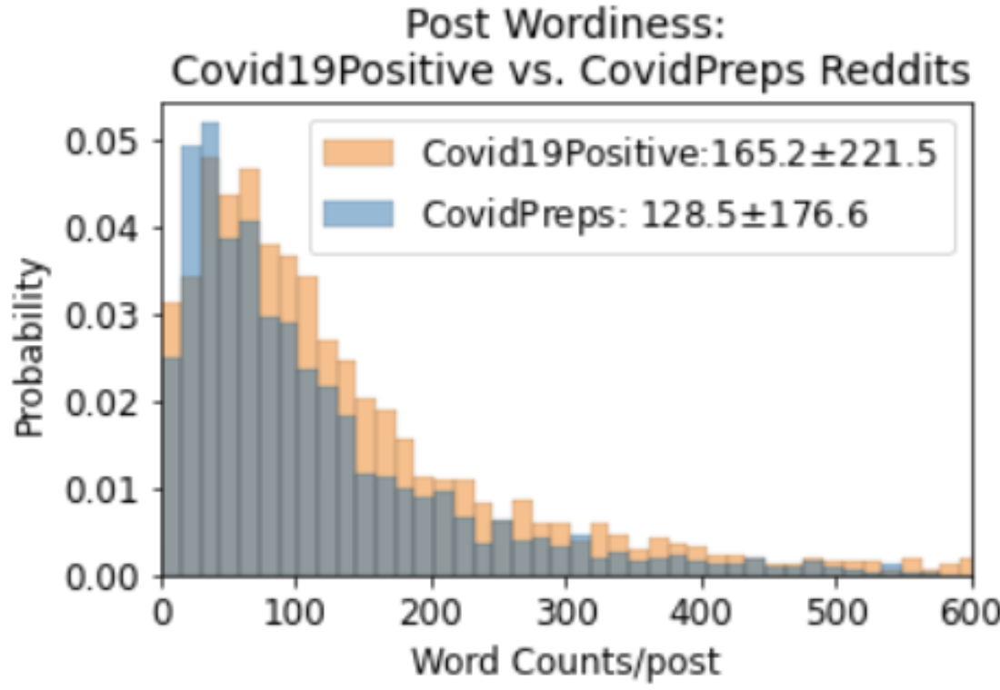

# **Classification Modeling and Sentiment Analysis of Pandemic Reddit Posts: Natural Language Processing**
  
## Investigator: Ehsan Gharib-Nezhad

[](https://www.linkedin.com/in/ehsan-gharib-nezhad/) &nbsp; [](https://github.com/EhsanGharibNezhad/)

---

## Problem Statement

The COVID-19 pandemic is one of the most significant global events in modern history. Natural Language Processing (NLP) acts as a bridge between human communication and computational analysis, offering robust statistical tools to analyze and classify text data. This project processes approximately 30,000 posts from the subreddit [Covid19Positive](https://www.reddit.com/r/COVID19positive/) and ~2,300 posts from [PandemicPreps](https://www.reddit.com/r/PandemicPreps/). Using over ten NLP models, including Logistic Regression and Random Forest, posts are classified based on their content. Additionally, sentiment analysis is conducted using *TextBlob* and *Multinomial Naive Bayes*.

---

## Table of Contents

- [Problem Statement](#problem-statement)
- [Repo Structure](#repo-structure)
- [Data Dictionary](#data-dictionary)
- [Background](#background)
- [1. Data Scraping: API](#data-scraping-api)
- [2. Text Normalization](#text-normalization)
  - [2.1. Tokenization](#tokenization)
  - [2.2. Lemmatization](#lemmatization)
  - [2.3. Stemming](#stemming)
- [Methodology](#methodology)
  - [Sentiment Analysis](#sentiment-analysis)
- [Exploratory Data Analysis](#exploratory-data-analysis)
- [Results](#results)
- [Conclusion](#conclusion)
- [Recommendations](#recommendations)
- [References](#references)

---


## Repo Structure

### `notebooks/`

#### Step 1: Reddit Data Scraping
- [`1_data-collection-Covid19Positive_subreddit.ipynb`](notebooks/1__data-collection-Covid19Positive_subreddit.ipynb)
- [`1_data-collectionPrepPandemic.ipynb`](notebooks/1__data-collectionPrepPandemic.ipynb)

#### Step 2: Text Processing
- [`2_1_text_processing_subreddit_covid19positive_v1.ipynb`](notebooks/2_1__text_processing_subreddit_covid19positive_v1.ipynb)
- [`2_2_text_processing_subreddit_PrepPandemic_v2.ipynb`](notebooks/2_2__text_processing_subreddit_PrepPandemic_v2.ipynb)
- [`2_3_Combined_cleaned_post_processed_datasets.ipynb`](notebooks/2_3__Combined_cleaned_post_processed_datasets.ipynb)

#### Step 3: Exploratory Data Analysis
- [`3_ExploratoryDataAnalysis_EDA.ipynb`](notebooks/3__ExploratoryDataAnalysis_EDA.ipynb)

#### Step 4: NLP Classification Models
- Logistic Regression, Decision Trees, Random Forest, Gradient Boosting, SVM, Naive Bayes, and more.

#### Step 5: Sentiment Analysis
- [`5-1_sentiment_analysis_VADER.ipynb`](notebooks/5-1__sentiment_analysis_VADER.ipynb)
- [`5-2_sentiment_analysis_Spacy.ipynb`](notebooks/5-2__sentiment_analysis_Spacy.ipynb)
- [`5-3_sentiment_analysis_textblob_NaiveBayesClassifier.ipynb`](notebooks/5-3__sentiment_analysis_textblob_NaiveBayesClassifier.ipynb)

#### Step 6: Model Comparison
- [`6_compare_all_modeling_results.ipynb`](notebooks/6__compare_all_modeling_results.ipynb)

### `datasets/`

- Raw and preprocessed datasets
- Model performance reports (Accuracy, Precision, Recall, Confusion Matrix)

### Additional Files
- [`presentation.pdf`](presentation.pdf)
- [`ReadMe.md`](ReadMe.md)

---

## Data Dictionary

| Feature Name  | Data Type | Description |
|--------------|-----------|-------------|
| selftext     | *object*  | Original Reddit posts (unprocessed) |
| subreddit    | *object*  | Subreddit category: r/Covid19Positive or r/PandemicPreps |
| created_utc  | *int64*   | Timestamp of Reddit post creation |
| author       | *object*  | Unique author ID |
| num_comments | *int64*   | Number of comments on the post |
| post         | *object*  | Processed Reddit post (normalized, unstemed words) |
| token        | *object*  | Processed Reddit post (stemmed words) |

---


## Background

### 1. Data Scraping: API

The pushshift.io Reddit API provides enhanced search and retrieval capabilities for Reddit comments and submissions. More details can be found [here](https://github.com/pushshift/api).

### 2. Text Normalization

Text preprocessing and normalization are essential steps in NLP. These steps convert raw text into a standard form suitable for analysis. Common text processing steps include:

- Lowercasing
- Removing punctuation & special characters
- Handling emojis and emoticons
- Stop word removal
- Spelling correction
- Removing URLs and HTML tags
- Tokenization
- Stemming & Lemmatization

#### 2.1 Tokenization

Tokenization is the process of breaking text into individual units (tokens). Examples include:

- **Sentence Tokenization:** Splitting text into sentences.
- **Word Tokenization:** Splitting sentences into words.
- **N-grams:** Extracting groups of consecutive words (bigrams, trigrams, etc.).

In this project, `nltk.tokenize` is used for tokenization:
```python
from nltk.tokenize import sent_tokenize, word_tokenize
```

#### 2.2 Lemmatization

Lemmatization reduces words to their base form (lemma) while preserving meaning. We use `WordNetLemmatizer` from `nltk`:
```python
from nltk.stem import WordNetLemmatizer
lemmatizer = WordNetLemmatizer()
```

#### 2.3 Stemming

Stemming reduces words to their root form using heuristic rules. We use `PorterStemmer`:
```python
from nltk.stem import PorterStemmer
stemmer = PorterStemmer()
```

---


# <a id = 'modeling_methodology'>3. Modeling Methodology to Label Subreddit Posts</a>


## 3.1 Logestic Regression
In ordinary least squares linear regression (often just referred to as OLS), we try to predict some response variable (y) from at least one independent variable (x). In contrast, 
Logistic regression deals with categories and gives us the probabilities of being in each class.
For logistic regression, that specific link function that transforms ("bends") our line is known as the logit link.


## 3.2 Classification and Regression Trees (CART) 
Decision Tree can be used to predict the class (discrete) (AKA. *Classification Tree*) or to infer continuous features such as house price which is called *Regression Tree*. The decision tree has the same analogy as the 20-question game to make decisions similar to how humans make decisions. It is a supervised machine learning algorithm that uses a set of rules for classification. The following library from **sklearn** is used to implement this model:

`from sklearn.tree import DecisionTreeClassifier`
 

<!--- ### 3.2.1 Terminology
- **Root Node**: What we see on top is known as the "root node," through which all of our observations are passed.
- **Leaf Nodes**: At each of the "leaf nodes" (colored orange), we contain a subset of records that are as pure as possible.
- A "parent" node is split into two or more "child" nodes. --->


### 3.2.1 Gini impurity
Gini impurity is a measure of how often a randomly chosen element from the set would be incorrectly labeled if it was randomly labeled according to the distribution of labels in the subset. The Gini impurity can be computed by summing the probability of a mistake in categorizing that item [[ref](https://en.wikipedia.org/wiki/Decision_tree_learning#Gini_impurity)]. In other words, **Gini impurity** is the probability that a randomly-chosen class will be labeled inaccurately, and is calculated by the following equation:


where *p* is the probability of item *i*. *Gini impurity* is between 0 and 1, where 0 shows the lowest impurity and 1 is the highest one. Both *Classification* and *Regression Trees* implement *Gini coefficient* to select the *root node* as well as the *node splision*. More details can be found in [[ref](https://medium.com/analytics-steps/understanding-the-gini-index-and-information-gain-in-decision-trees-ab4720518ba8)].     


## 3.3 Classification and Regression Trees including Bootstrap Aggregating (Bagging)  

Although *Decision trees* are powerful machine learning models, they tend to learn highly irregular patterns (a.k.a. they overfit their training sets). *Bagging* (*bootstrap aggregating*) mitigates this problem by exposing different trees to different sub-samples of the training set. In this method, a set of bootstrapped samples (or ensemble, see the following flowchart) is generated with the inclusion of replacement. Consequently, a set of decision trees is generated in order to account for the variability and reduce the overfitting issue (or to improve the variance). The following library is used from **sklearn**to implement this approach:

`from sklearn.ensemble import BaggingClassifier`\
`BaggingClassifier(random_state = 42)`


## 3.4 Random Forest

With bagged decision trees, we generate many different trees on pretty similar data. These trees are strongly correlated with one another. Because these trees are correlated with one another, they will have a high variance. Looking at the variance of two random variables X and Y, if X and Y are highly correlated, then the variance will about as high as we'd see with individual decision trees. By "de-correlating" our trees from one another, we can drastically reduce the variance of our model. That's the difference between bagged decision trees and random forests! 

The following equations articulate this correlation and variance in simple math [[ref](https://www.probabilitycourse.com/chapter5/5_3_1_covariance_correlation.php)]:


where the the covariance between X and Y is defined as:


where E[X] and E[Y] is the expected (or mean) value of X and Y.

Random forests differ from bagging decision trees in only one way: they use a modified tree learning algorithm that selects, at each split in the learning process, a random subset of the features. This process is sometimes called the random subspace method. The following library is implemented in this model:

`from sklearn.ensemble import RandomForestClassifier`


## 3.5 Extremely Randomized Trees (ExtraTrees)


*ExtraTrees* has an extra feature to even more randomize (and thus de-correlation) decision tress compared to the conventional *Random Forest* method. In the *ExtraTrees* method, the features at the *root node* and *leaf nodes* are selected randomly without utilizing *Gini impurity* or *information gain*. In addition, the split in each node is determined by selecting a subset of randomly selected features within that subset size (i.e., usually the square root of the total features). The following library is used for this method:

`from sklearn.ensemble import ExtraTreesClassifie`


## 3.6 Naïve Bayes

Naive Bayes classifiers rely on the Bayes theorem which is a conditional theory. 
 [Conditional theory](https://www.statisticshowto.com/probability-and-statistics/probability-main-index/bayes-theorem-problems/) is the probability of an event happening, given that it has some relationship to one or more other events. For example, your probability of the temperature given that is connected to the sunlight, humidity, and altitude. 
Another example of Bayes theorem is in medical research cases such as the probability of having kidney disease if they are alcoholic [[ref]](https://www.statisticshowto.com/probability-and-statistics/probability-main-index/bayes-theorem-problems/). 

In conditional theory, P(A|B) is the probability of event A given that event B has occurred. Since we are assuming that A and B are independent, we can write their joint probability of A and B as P(A and B) = P(B and A). Note that the joint probability of X and Y or P(X ∩ Y) can be written as P(X). P(Y|X). Therefore,  P(A and B) = P(B and A) will be written as:

 

Rearranging it leads to Bayes' theorem.  


 


**Naïve Bayes** is a supervised machine learning algorithm that could be used for classification problems. However, in comparison with another classifier, this model assumes that features are independent of each other, and there is no correlation between them [[ref]](https://towardsdatascience.com/naive-bayes-classifier-explained-50f9723571ed). This is why it is called *naïve*.  **Naïve Bayes Classifier** needs to store probability distribution for each feature. The type of distributions depends on the feature properties, including:

1. **Bernoulli distribution**: for binary features (e.g., rainy day: Yes or No?)  
2. **Multinomial distribution**: for discrete features (e.g., word counts)  
3. **Gaussian distribution**: for continuous features (e.g., House price)  

Naive Bayes classifiers are relativity fast comparing to *Random Forest*, but the assumption of independent features imposes some inaccuracy to the results. The following library is implemented to use this model:

` from sklearn.naive_bayes import GaussianNB, BernoulliNB, MultinomialNB `


# 4. <a id = 'sentiment'> Sentiment Analysis: Reddit Posts </a> 
Sentiment analysis is the study of the text sentiment, the positive or negative orientation that a writer expresses toward some topics. For instance, all product review systems such as IMDB have numerous amount of words for each movie, some positive, some negatives, and some neutral. The main goal is to employ some words such as "great", "disappointing", and many others as indicators to conclude and rate the text's sentiment. In this project, *VADER* ( Valence Aware Dictionary for Sentiment Reasoning) is a model used for text sentiment analysis that is sensitive to both polarities (positive/negative) and intensity (strength) of emotion [[ref](https://towardsdatascience.com/sentimental-analysis-using-vader-a3415fef7664)].
The following library is employed to load *VADER*:

`from nltk.sentiment.Vader import SentimentIntensityAnalyzer`

<br></br>

<br></br>


# <a id = 'eda'> <b>5. Exploratory Data Analysis</b>
Posts in Covid12Positive have more words as the following figure shows.

<br></br>

<br></br>
    
# <a id = 'Results'>6. Results</b>

In the entire project, all posts are split into train and testing sets with the proportion of 75% and 25%, respectively. For each dataset, accuracy, precision, recall, F1 score as well as their false positive, false negative, and true positive and negative values are reported. The following equations are showing their definitions [[ref](https://developers.google.com/machine-learning/crash-course/classification/precision-and-recall)]:

<br></br>

<br></br>

## <a id = '6_1'> 6.1 Compare Metric Scores of Different Models</b> 

In the following figures, the accuracy, recall, precision, and F1-score for different models are represented. 
 
<br></br>

<br></br>

<br></br>

<br></br>


<br></br>

<br></br>

<br></br>

<br></br>

---
---

An overview of the final results are presented in the following infograph:


<br></br>

<br></br>
     
# <a id = 'Conclusion'>Conclusion</b>

Logistic Regression emerges as the most effective model for classification due to the following key reasons:

- Achieves high accuracy, with ~99% on the training set and ~96% on the testing set.
- Performs exceptionally well with highly imbalanced datasets (~93% vs. ~7%).
- Exhibits strong performance in terms of true positives (91.06% out of 93%) and true negatives (5.5% out of 7%).
- Minimizes errors with low false positive (1.57%) and false negative (1.87%) rates.
- Demonstrates impressive precision and recall, both around 98%.

In addition, this model is…..

- Interpretable 
- Optimizable coefficients to reduce variance and bias
- Capable to use different generalization methods i.e., Lasso, Ridge, ElasticNet
- Tunable parameters, solvers, and penalty functions for multiple cases 
- Works best with both large and small datasets


